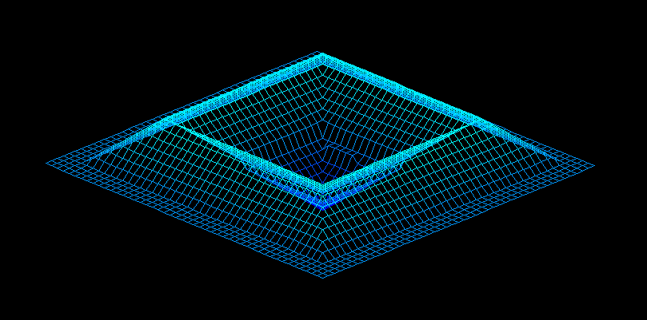

# FdF

This graphical project is part of the curriculum at 42 school and aims to provide a wireframe rendering program for 3D maps. The project involves creating a program that takes a map file as input, interprets the data to generate a wireframe representation, and renders it using a graphical library called "MiniLibX". (https://github.com/42Paris/minilibx-linux)



## Table of Contents

- [Project Description](#project-description)
- [Installation and Usage](#installation-and-usage)
- [Features](#features)

## Project Description

The "FdF" project focuses on developing a program that can read a map file containing height information and generate a wireframe representation of the map in a graphical window. The main objectives of the project are:

1. Parsing the map file to extract the height data.
2. Implementing a rendering algorithm to display the wireframe in a graphical window.

## Installation and Usage

To install and run the project, follow these steps:

1. Clone the repository to your local machine:

```
git clone <repo url> fdf
```

2. Navigate to the project directory:

```
cd fdf
```

3. Compile the program by running the make command:

```
make
```

4. Go to the "bin" directory:

```
cd bin
```

5. Execute the program binary by specifying a map file as an argument. Each line of the file represents a row of the map, and the numbers on each line represent the height values.

```
./fdf ../maps/pylone.fdf
```

6. Close the program window to exit.

Now you should be able to run the program by following these steps. Make sure you have installed the necessary dependencies: **e.g. sudo apt-get install gcc make xorg libxext-dev libbsd-dev (Debian/Ubuntu)**.

## Features

The "FdF" program includes the following features:

- Wireframe rendering of 3D maps.
- Support for different map sizes and heights.
- Color gradients to represent the height values.